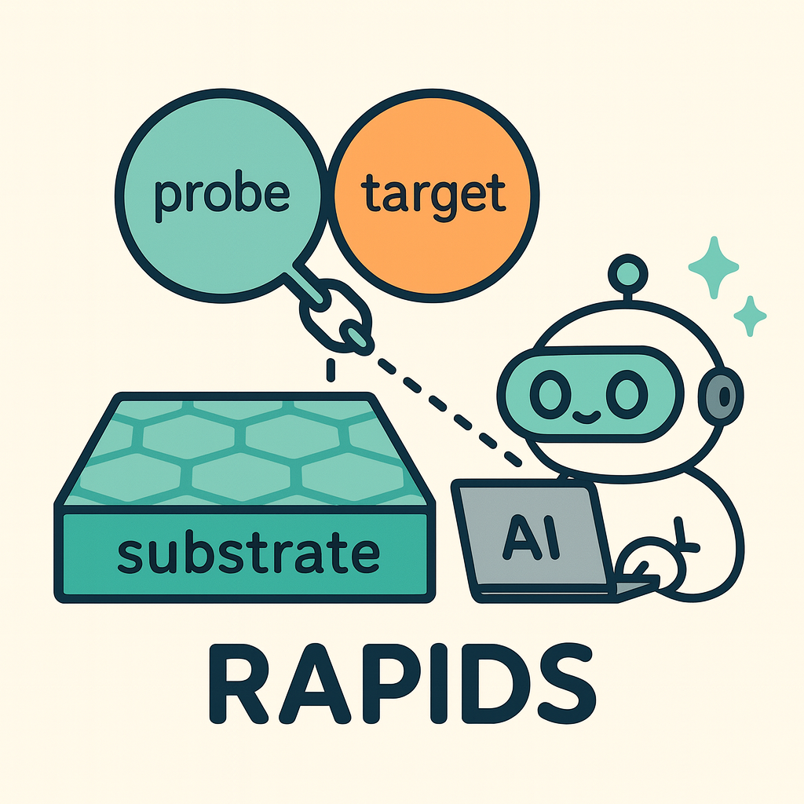

# RAPIDS: Rapid Adsorption Probe Interaction Discovery System

<div align="center">
  
  
  **RAPIDS** - **R**apid **A**dsorption **P**robe **I**nteraction **D**iscovery **S**ystem
  
  *ML-accelerated molecular interaction calculations using FAIRChem's Universal Materials Atomistic (UMA) models*
</div>

---

## Overview

RAPIDS is designed for researchers with minimal computational chemistry background to perform quick, qualitative dry-lab simulations of probe-target-substrate interactions. Only 2 parameters required to start!

## Features

- **Automatic molecule download** from chemical names (PubChem + rare molecules collection)
- **Smart optimization** with auto-continuation and structure validation
- **Batch screening** - Compare multiple molecules and rank by binding affinity
- **Three-component system** - Calculates target binding to already-adsorbed probe on substrate
- **Advanced placement** - Custom molecular positioning for MOF pores, etc.
- **Cross-platform** - Works on Mac, Linux, and Windows
- **Minimum hardware required** - User can use cuda, or default CPU for edge device users.

## Quick Start

### Prerequisites
1. **Get UMA model access**: Register at [HuggingFace](https://huggingface.co/facebook/UMA) and request access of the checkpoints
2. **Download model** (one-time): Run `python download_model.py` and enter your HuggingFace token

Or manually:
```python
from huggingface_hub import login
from fairchem.core import pretrained_mlip
login(token="hf_YOUR_TOKEN_HERE")  # Get token from HuggingFace settings
model = pretrained_mlip.get_predict_unit("uma-s-1p1")
```

### Setup Environment
```bash
# Install required packages
pip install fairchem-core
pip install pubchempy
```

### Run Simulations
```bash
# Run simplest example (just 2 parameters!)
python smart_fairchem_flow.py example_configs/tutorials/01_simplest.json
```

Or create your own minimal config:
```json
{
  "probe": "glucose",
  "substrate": "Graphene"
}
```

## Batch Screening

Compare multiple molecules to find the best binder:

```bash
# Screen sugars binding to caffeine
python batch_comparison.py example_configs/screening/sugar_screening.json
```

Multi-substrate support:
```json
{
  "probes": ["PFHxS", "PFOS", "PFDoDA"],
  "substrates": ["Co_HHTP", "Cu_HHTP", "Ni_HHTP"]
}
```

## File Structure

```
smart_fairchem_flow.py    # Single molecule simulation
batch_comparison.py        # Multi-probe screening  
batch_opt.py              # Batch geometry optimization
simulation_builder.py      # Structure generation
molecule_downloader.py     # Molecule retrieval

example_configs/          # Ready-to-use examples
├── tutorials/            # Beginner (use smart_fairchem_flow.py)
├── screening/            # Batch screening (use batch_comparison.py) 
├── advanced/             # Custom positioning (use smart_fairchem_flow.py)
└── applications/         # Research cases (mixed usage)

rare_molecules/           # Complex molecules (beta-CD, CNT)
substrate/                # 2D materials & MOFs
molecules/                # Downloaded molecules (auto-created)
simulations/              # Results (auto-created)
```

## Supported Substrates

**2D Materials:** Graphene, MoS2, BP, Si, ZnO  
**MOFs:** Co_HHTP, Cu_HHTP, Ni_HHTP  
**Special:** vacuum (no substrate)

## Output

Results in `simulations/[run_name]/`:
- Optimized structures (`.vasp`)
  - `probe_substrate_optimized.vasp` - Probe on substrate
  - `probe_target_substrate_optimized.vasp` - Three-component system
- Interaction energies (`interactions.json`)
  - Probe adsorption energy
  - Target binding to adsorbed probe
  - Substrate effect on binding
- Analysis report (`smart_report.txt`)

## Documentation

See [USER_MANUAL.md](USER_MANUAL.md) for detailed parameters and troubleshooting.

## License

Based on [FAIRChem](https://github.com/FAIR-Chem/fairchem).